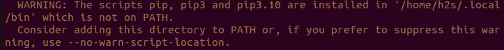

# ghfetch
<video loop src="./preview.webm">Preview</video>

> The previous video has as examples the commands:
>
> * `ghfetch ghfetch` - (An organization)
> * `ghfetch icutum` - (A user)
> * `ghfetch nullgaro` - (A user)
> * `ghfetch torvalds/linux` - (A repo)

## Description
A nice way to display CLI user / organization / repo info inspired in [Neofetch](https://github.com/dylanaraps/neofetch)

ghfetch is a CLI information tool written in `Python >= 3.5` that displays info about any user/org/repo you pass as argument.

Upon execution, the script displays on the terminal relevant information, like the profile picture, public repos, stars, followers, etc.

Additionally, in this project, we've used Github Actions to be able to create a new release each time we merge to main, thanks to this, the build for AUR is easier.

## Installation

### Package manager

**Arch Linux:**</br>
Use your favorite AUR helper, i.e:
```sh
yay -Syu ghfetch
```

**PIP:**
```sh
pip install --upgrade pip
pip install ghfetch-pip
```
> For troubleshooting see [here](https://github.com/ghfetch/ghfetch#troubleshooting-).

### Manual installation
```sh
git clone https://github.com/ghfetch/ghfetch.git
cd ghfetch
pip install .
```

## Usage
```sh
ghfetch <user or organization>
```

```sh
ghfetch <user>/<repo>
```

### Example usage

**User:**
```sh
ghfetch nullgaro
ghfetch icutum
```

**Organization:**
```sh
ghfetch ghfetch
ghfetch confugiradores
```

**Repo:**
```sh
ghfetch torvalds/linux
ghfetch ghfetch/ghfetch
```

## To-do's 📋

### Code 💻

- [ ] Private API key for access to private repositories

### Package upload 📦

- [X] Yay
- [ ] Apt
- [X] Pip
- [ ] Snap
- [ ] DNF/Yum
- [ ] Brew
- [ ] Windows
- [ ] Zypper
- [ ] DPKG

### Wishlist 🥺
- [ ] Pacman

## Troubleshooting 🛠️
### Warn: `WARNING: The scripts ghfetch-pip is installed in '/home/USERNAME/.local/bin' which is not on PATH.`

If you are installing ghfetch using PIP, and you get a similar warning to this:</br>


The solution is to add `export PATH=/home/user/.local/bin:$PATH` to your .bashrc, where `/home/user/.local/bin` would be the path that the warning is telling you, and reboot.

### Updating ghfetch using yay doesn't update it

This issue happens because the yay's cache is interfering with the update. The solution is to clear the cache of yay with `yay -Sc --aur`.

## People 👨‍💻
This project was developed with ❤️ by [Nullgaro](https://github.com/nullgaro) and [Icutum](https://github.com/icutum).

* [Nullgaro](https://github.com/nullgaro)
* [Icutum](https://github.com/icutum)